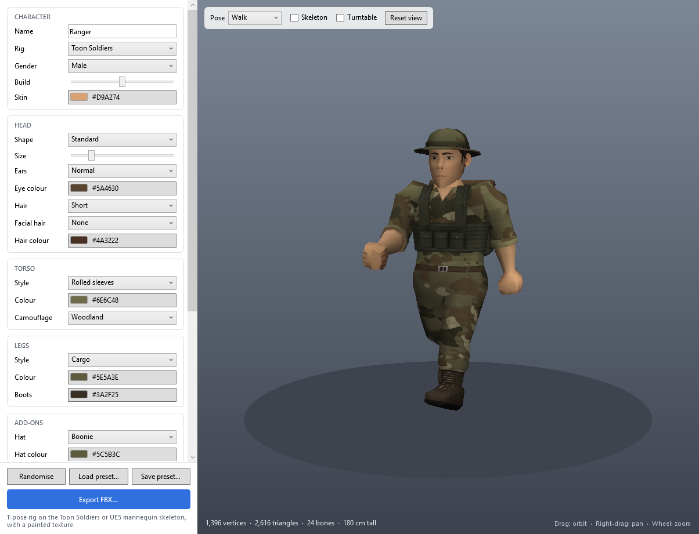

# Low Poly Character Generator

A WPF tool that builds low-poly characters procedurally and exports them as rigged, skinned
**FBX** files in a **T-pose**, with a painted texture for the face, clothing and gear. Two rigs:

* **Toon Soldiers** (default): the chunky proportions of the *Toon Soldiers Armies* pack on that pack's
  own skeleton (`Characters_Skeleton`, a 3ds Max Biped), so the generated characters import onto it
  and play all of the pack's animations and weapon attach points.
* **UE5 mannequin**: realistic proportions on a skeleton that matches `SK_Mannequin`.



## Running

```
dotnet run --project src/LowPolyCharGen.App
```

Requires the .NET 10 SDK on Windows. There are no NuGet dependencies.

Pick the options on the left, check the result in the 3D preview and press **Export FBX…**.
Four files are written: `<name>.fbx`, `<name>_Diffuse.png` (the clean texture the FBX references),
`<name>_Grime.png` (the grime layer: RGB = dirt, lit like the texture; A = its coverage at full
grime) and `<name>.json` (the options, a preset). Blend the layer in a material as
`lerp(Diffuse.rgb, Grime.rgb, Grime.a * amount)`; the app's preview shows it baked at the Grime slider.

| Group     | Options |
|-----------|---------|
| Character | name, grime, rig (Toon Soldiers or UE5 mannequin), edition (desert, snow, jungle, civilian, militia), gender, build (slim to heavy), skin tone |
| Head      | face cover (balaclava, shemagh); fatigue and stress; face shape (standard, square, round, slim, heavy), size, ears (normal, pixie, elephant, stick out), eye colour, hair (8 styles), facial hair (stubble, moustache, goatee, beard, bushy beard), hair colour |
| Torso     | T-shirt, long sleeve, rolled sleeves, tank top, jacket, hoodie, polo, check shirt; colour; camouflage (woodland, digital) |
| Legs      | trousers, cargo, shorts, tall boots, skirt, jeans, thobe; boots or trainers; trouser and boot colours |
| Add-ons   | hat (helmet, cap, beret, boonie, beanie, keffiyeh, turban), eyewear, backpack (light, rucksack, hydration, radio), vest (chest rig, plate carrier), belt (plain, pouches, utility with holster), gloves, scarf, knee and elbow pads; hat, gear and accent colours |
| Output    | texture size (512, 1024 by default, or 2048), flat or smooth shading, IK bones on/off (mannequin rig) |

The preview can show the skeleton and a few test poses (A-pose, relaxed, walk, action) so the skin
weights can be judged. Poses are preview only: the export is always the T-pose bind.
**Randomise** rolls a character; presets are saved and loaded as JSON.

## How the characters are made

**Mesh.** Hips, torso, neck, head, arms, hands and legs are one continuous surface (about 800
vertices), so shoulders and hips deform without gaps. Only the left half is modelled; it is mirrored
and welded along the centre line. The head is a sculpted grid whose jaw line is a hard edge over a
separate under-jaw surface; each face shape is a different set of proportions for that grid. Ears
are small shell-shaped meshes. Clothing changes the mesh only where it changes the silhouette
(loose trouser legs, cuffs, hems, a skirt); gear, hats and longer hair are separate pieces on top.

**Texture.** Everything else is paint. The atlas (at most 2048 x 2048) is generated, not drawn:
each texel knows where it lies on the character, and a procedural painter decides its colour from
that position - eyes, brows, lips and stubble on the face; necklines, plackets, pockets, belts,
seams, folds and camouflage on the clothes; laces and soles on the boots; flaps and webbing on the
gear. Because the painter works from the model position rather than the UV layout, features line
up across UV seams and follow whatever shape the options produce. Soft shading under the chin,
arms and gear is baked in from ambient occlusion.

The painter lives in `src/LowPolyCharGen.Core/Texturing/Painter*.cs`; to change how something
looks, that is the place.

## Toon Soldiers rig

The character is built on the mannequin T-pose as usual and then reshaped (`ToonRig.cs`): every
mannequin bone gets an affine map that thickens it in a frame aligned with the bone, turns it onto
the matching pack bone and moves its joint onto the pack's joint; vertices move by the weighted blend
of their bones' maps, so clothes, gear, hair and hats follow. The proportions (wide trunk, thick
limbs, 1.5x head, block fists, tall boots) are the constants at the top of `ToonRig.cs`; measured
against the pack's soldiers they agree within a centimetre or two. The skin weights are then moved
onto the pack's bones (the five spine bones become `Bip001-Spine`, both neck bones `Bip001-Neck`).

The exported skeleton is the pack's reference pose exactly (`ToonSoldierData.cs`, generated by
`tools/gen_toon_data.py` from `tools/toon_soldiers_skeleton.json`, a dump taken in the editor):
24 bones, `Bip001` root at the pelvis with the Biped's 1.8 scale, `WeaponContainer`,
`WeaponContainer_L` and `Backpack_container`. Imported meshes match the pack's reference pose to
0.0001 cm. Unreal's importer reports "some invalid bind poses" for this rig (it does for any root
with a scale) and rebinds from the time-zero pose, which is the same pose, so it is harmless.

**Uniform editions.** `Edition` = Desert (khaki, sand/brown three-colour camo, tan boots), Snow
(white with pale and mid grey camo, kept cool rather than warm) or Jungle (greens with brown and
near-black). Picking one sets the clothing, hat, gear, boot and accent colours and switches the
camouflage on (all still editable) and gives the camouflage that theatre's colours; `Custom` keeps
your own colours. On the command line: `--set Edition=Snow`. `Civilian` instead swaps military kit
for civvies (no camo or vest, jeans, trainers, a hoodie instead of a jacket) and Randomise then
picks civilian outfits and colours. `Militia` (styled on the Toon Soldiers Militia pack) dresses irregular
forces: camouflage on the trousers only (`CamoCoverage`) in urban greys, a shemagh face wrap,
surplus chest rigs and boots; Randomise then mixes dark civvies, balaclavas or shemaghs, beanies,
berets and old helmets. `FaceCover` = Balaclava (knit, eye slit, no hair) or Shemagh (wrapped over
the nose and mouth, with a matching scarf) works with any edition; its colour is `AccentColor`.
Traditional dress: `Legs = Thobe` (ankle-length robe in the shirt's cloth), `Hat = Keffiyeh` (headcloth
in the shemagh pattern, draped to the shoulders, black agal) or `Turban`; `FacialHair = BushyBeard`
is a real beard mesh. The militia randomiser dresses about a third of the men this way.

**Weathering** (painted, 0..1): `Grime` (dust and smudges everywhere, dirt in creases, mud up the
legs), `Fatigue` (dark rings and bags under the eyes, red lids, sallow skin, hollow cheeks) and
`Stress` (furrowed brow, forehead lines, deep nose-to-mouth folds, sweat).

The texture gets the pack's hand-painted finish on this rig: deeper baked occlusion, a strong top
light, broad brush-like value patches and muted warm colours.

## What is in the FBX (mannequin rig)

* Binary FBX 7.4, centimetres, Z-up, character facing -Y in the file. Unreal imports that as a
  character facing +Y with an untransformed `root` bone, the same layout as the UE mannequin.
* One skinned mesh (roughly 1,600 to 2,800 triangles) with at most 4 bone influences per vertex,
  explicit normals, one UV set, a bind pose and one material with the diffuse texture.
* Skeleton: `root, pelvis, spine_01..05, neck_01, neck_02, head, clavicle/upperarm/lowerarm/hand_l/r,
  thigh/calf/foot/ball_l/r` plus the optional `ik_foot_*` / `ik_hand_*` bones. Names, hierarchy,
  joint positions and bone orientations are the UE5 mannequin's (`SK_Mannequin`). Trunk and leg
  bones are identical to its reference pose; the arms are rotated out to a T-pose with the bone
  lengths kept. Finger and twist bones are not included (fingers are painted on a mitten hand).
* The character is the mannequin's size: same joint positions, 181 cm tall at head size 1.0.

### Importing into Unreal

**Toon Soldiers rig:** run `tools/import_unreal.py` in the editor (Tools > Execute Python Script, or
`py "C:/source/Claude/LowPolyCharGen/tools/import_unreal.py" "D:/out" /Game/LowPolyCharGen` in the
Python console). For every FBX in the folder it imports `SK_<name>` onto
`/Game/Toon_Soldiers_Armies/Meshes/Characters_Skeleton`, its texture as `T_<name>`, makes
`MI_<name>` (a `M_Armies_Parent` instance using it) and assigns the pack's physics asset. Any pack
animation, Blueprint or weapon socket then works with the new mesh.

**Mannequin rig:** import the FBX as a skeletal mesh. Either let Unreal create a new skeleton, or pick `SK_Mannequin`
as the skeleton to share the mannequin's animations (the bones are a subset of that skeleton, so
it binds without changes). Leave "Use T0 as ref pose" off. With "Import textures" on, the texture
and a material are created automatically.

## Command line

`src/LowPolyCharGen.Cli` exports without the UI:

```
lowpolychargen --out soldier.fbx --set Hat=Helmet --set Backpack=Rucksack --set Camouflage=Woodland
lowpolychargen --out soldier.fbx --preset soldier.json
lowpolychargen --random 20 --out-dir out --seed 7
lowpolychargen --variants out        # one FBX per option value
lowpolychargen --check               # validates both rigs and a few hundred generated meshes
lowpolychargen --pose-test poses.json --out-dir poses --set Hat=Boonie
                                     # skins a Toon Soldiers character with bone poses dumped from
                                     # the pack's animations in Unreal and writes one OBJ per frame
```

Use `--set Rig=Mannequin` for the mannequin rig.

`--set` takes any property of `CharacterSpec` (`Property=Value`, colours as `#RRGGBB`).

## Code layout

```
src/LowPolyCharGen.Core     generator and exporter, no UI dependencies
  CharacterSpec.cs            every option; bindable, JSON-serialisable, randomiser
  Skeleton.cs                 mannequin T-pose and Toon Soldiers skeletons (MannequinData.cs, ToonSoldierData.cs)
  ToonRig.cs                  reshapes a built character onto the Toon Soldiers skeleton and proportions
  MeshBuilder.cs              skinned primitives, UV charts and atlas packing, mirroring/welding, normals
  Profile.cs                  torso and head volumes that can be meshed and queried
  Skinning.cs                 weight functions (rigid, bone chains with cross-fades, blends)
  Parts/BodyBuilder.cs        the welded body: hips, torso, neck, arms, hands, legs, boots
  Parts/HeadBuilder.cs        skull and face shapes, ears, hair, hats, eyewear
  Parts/GearBuilder.cs        vests, backpacks, belt kit
  Texturing/Painter*.cs       the procedural painter (face, clothes, materials)
  Texturing/TextureBaker.cs   rasterises the mesh into the atlas; PNG encoder
  Texturing/AmbientOcclusion.cs   baked soft shading
  Fbx/                        FBX node tree, binary 7.4 writer, exporter
  Posing.cs                   linear blend skinning for the preview poses
src/LowPolyCharGen.App      WPF front end (WPF 3D preview, colour pickers, presets)
src/LowPolyCharGen.Cli      headless exporter and consistency checks
tools/                      Blender contact-sheet renderer, skeleton data generators, Unreal import script
unreal/LowPolyCharTest      UE 5.8 C++ test project: native locomotion anim instance, playable soldier, lineup (see its README)
```

Model space everywhere is right-handed, centimetres: **+X = character's left, -Y = front, +Z = up**.

### Adding things

* **An option value:** add it to the enum in `CharacterSpec.cs` (it shows up in the UI
  automatically), then handle it in the matching builder and, if it is paint, in the painter.
* **Geometry:** primitives take a `Slot` (what the surface is made of) and a weight function, e.g.
  `mesh.AddBox(centre, halfExtents, Slot.Hat, c.HeadRigid)`. Left/right pairs go inside
  `mesh.Mirrored(m => ...)`. Things worn on the body sample its surface (`c.Torso.FrontY(z, x)`,
  `c.Head.Surface(...)`, `leg.RadiusU(z)`) so they follow gender and build. UVs are automatic.
* **Paint:** each body `Slot` has a method in the painter that receives the texel's position and
  normal. Landmarks such as eye height, hem and boot-top heights come from `PaintContext`.

Run `lowpolychargen --check` afterwards, and `tools/preview.ps1` to look at the result.

### Visual checks

`tools/preview.ps1` exports characters with the CLI, imports the FBX files into Blender
(headless) and renders a contact sheet, which also proves the files load in a second importer:

```
.\tools\preview.ps1 -Out sheet.png -Sets "Hat=Helmet,Backpack=Rucksack", "Gender=Female,Hair=Bob" -Pose
.\tools\preview.ps1 -Out heads.png -Sets "HeadShape=Square,FacialHair=Beard" -Head
```

`tools/gen_mannequin_data.py` regenerates `MannequinData.cs` from a reference-pose dump of the
mannequin taken in the Unreal Editor.
